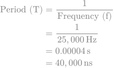

:toc:
:toc-title: 目次
= Raspberry Pi Picoで動かす！二重反転ファンコントローラー

== 主な特徴
* ポテンショメータによるファンの無段階速度調整
* 2つのファンの回転数をリアルタイムで取得
* 2つの7セグLEDにそれぞれの回転数を表示

== 必要な部品 (Hardware Requirements)
* Raspberry Pi Pico
* 二重反転ファン (XXXXXX)
* HT16K33 2 pics
* 7segment LED (common cathode) 14Pics
* 10kΩ ポテンショメータ

== 回路図 (Schematic)
TBD

== ライセンス (License)
MIT License

== 豆知識
=== PWMクロック周波数設定について

マイコンデフォルトの周波数をそのまま利用してもモーター制御自体は特に問題なく可能だが、PWM周波数25kHz近辺に変更する。DCモーターのPWM制御における一般的な推奨周波数が20Khz以上と言われているためである。

.PWM周波数を求める数式
****
image::./doc/images/mf1.svg["PWM周波数を求める数式",align="center"]
****
. picoのデフォルト周波数を利用した場合
+
image::./doc/images/mf2.svg["PICOデフォルト周波数から計算",align="center"]
+
結果より、picoでデフォルトのまま利用すると約1.9kHzぐらいのPWM周波数となり、モーター制御はできるかもしれないが、推奨範囲外のため、最適な選択とは言えない。

. picoでPWM周波数を約25kHzに変更する
.. tinygo
+
[source,go]
----
pwm.Configure(machine.PWMConfig{Period: 40000})
----
+
PWMConfigに対して周期をナノ秒で指定している。指定した値は以下によって算出している
+
.25kHzの周期ナノ秒を算出
+

+
このように、tinygoを利用すると極めてシンプルに設定可能だ。

.. c++
+
このプロジェクトをまだplatform ioを利用してcppで書いていた頃の記憶として残しておく。
+
[source,cpp]
----
  pwm_set_clkdiv(slice_num, 1.220703125); // 算出
  pwm_set_wrap(slice_num, 4096); // 事前に決めた値
----
+
c++で実装したときは、クロック分周を指定する必要があったため、クロック分周を算出している。
+

.周波数を求める式を変形して分周を求める
****

****
+
この変換式を利用して実際の値からクロック分周比を求める。
+
image::./doc/images/mf5.svg["分周算出",align="center"]
+
求めた値を実際に先のプログラムのように設定することで、25kHz周波数のPWM信号としていた。

=== 利用するポテンションメーターについて
* 抵抗値が低すぎる場合
+
無駄な電流が流れ、ポテンションメーターが熱くなる。また、Picoに無駄な負担をかける。
* 抵抗値が高すぎる場合
+
高すぎる抵抗（1Mなど）でPicoの内部抵抗（入力インピーダンス）に近づくと、Picoが電圧を正確に読み取れなくなる。

これらの理由から、 5kΩ 〜 50kΩ の範囲のポテンショメータが、このプロジェクトではバランスが良くて理想的である。 +
その中でも、10kΩ のポテンショメータが最も一般的で、どんな場面でも安心して使える「黄金の抵抗値」として扱われるのでだいたいみんな使ってる。 +