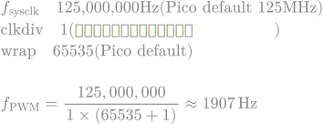
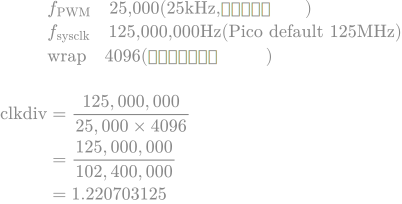

[日本語 (Japanese)](./README.ja.md)

---

# Raspberry Pi Pico Dual Contra-rotating Fan Controller

> **Note:** This document was originally written in Japanese and has been translated into English with the assistance of Gemini.

## Features
* Stepless fan speed adjustment via a potentiometer.
* Real-time RPM (Revolutions Per Minute) monitoring for two fans.
* Display of each fan's RPM on two separate 7-segment LEDs.

## Hardware Requirements
* Raspberry Pi Pico
* Dual Contra-rotating Fan (e.g., XXXXXX)
* 1x HT16K33 I2C 7-segment LED driver boards
* 16x 7-segment LEDs (common cathode)
* 1x 10kΩ Potentiometer

## Schematic
TBD

## License
MIT License

## Technical Deep Dive
### About PWM Clock Frequency Settings

While it's possible to control the motor using the microcontroller's default PWM frequency, this project changes it to approximately 25kHz. This is because the generally recommended frequency for PWM control of DC motors is 20kHz or higher.

* **Formula for calculating PWM frequency**

    <p align="center">
      
    </p>

* **Calculation using the Pico's default frequency**

    <p align="center">
      
    </p>

    As the result shows, using the Pico's default settings results in a PWM frequency of about 1.9kHz. While this might be able to control the motor, it is outside the recommended range and thus not an optimal choice.

### Changing the PWM frequency to ~25kHz on the Pico
* **With TinyGo**

    ```go
    // The period is set in nanoseconds.
    pwm.Configure(machine.PWMConfig{Period: 40000})
    ```

    To achieve a 25kHz PWM frequency on the Raspberry Pi Pico, the `Period` for `PWMConfig` is specified in nanoseconds. The value used was calculated as follows:

    <p align="center">
      
    </p>

    As you can see, setting this up with TinyGo is extremely simple.

* **With C++**

    This is kept as a record from when I was initially writing this project in C++ using PlatformIO.

    ```cpp
    pwm_set_clkdiv(slice_num, 1.220703125); // Calculated value
    pwm_set_wrap(slice_num, 4096);         // Pre-determined value
    ```

    When implementing in C++, it was necessary to specify the clock divider, so I had to calculate it.

    By rearranging the frequency formula, we can solve for the clock divider:

    <p align="center">
      
    </p>

    Using this rearranged formula, the clock divider ratio can be found from the actual values:

    <p align="center">
      
    </p>

    By setting the calculated value as shown in the program above, a 25kHz PWM signal was achieved.

### About the Potentiometer
* **If the resistance is too low:**

    Excess current will flow, causing the potentiometer to heat up. This also places an unnecessary load on the Pico.

* **If the resistance is too high:**

    If the resistance is too high (e.g., 1MΩ) and approaches the Pico's internal input impedance, the Pico will be unable to accurately read the voltage.

For these reasons, a potentiometer in the range of 5kΩ to 50kΩ is ideal and well-balanced for this project.

Among these, the 10kΩ potentiometer is the most common and is often treated as the "golden standard" that can be used reliably in almost any situation, which is why it's so widely used.